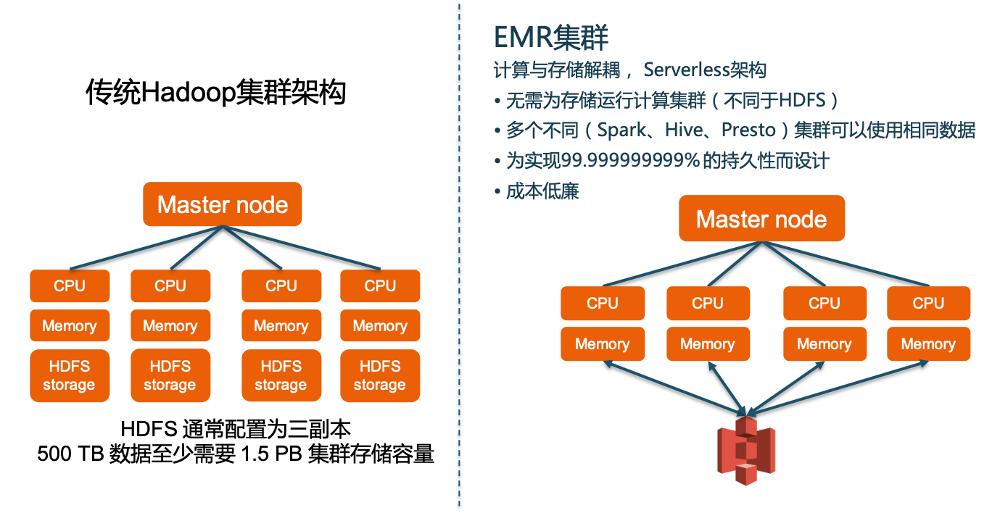

# AWS EMR最佳实践#

1. AWS大数据服务框架  
  
  基于数据湖的大数据收集、存储、处理、分析架构，全部的处理均围绕着以S3为基础来构建的数据湖来进行。
  
  
AWS的托管Hadoop集群——EMR
与传统Hadoop集群相比，所具有的特点：
- 通过 S3解耦计算和存储，同时可利用HDFS或本地磁盘作为中间数据或缓存数据的存储，用以加快性能
- 按需启动或关闭集群, 集群弹性伸缩
- AWS负责集群的管理，易于使用
- 具备常用的Hadoop生态系统组件
- 与S3无缝集成, 通过EMRFS直接访问S3中数据

与传统Hadoop集群相比，更具备灵活性


2. 最佳实践配置
- 2.1 集群硬件配置 — 三种节点类型
  
**主节点 (Master Node)：** 主节点管理群集，通常运行分布式应用程序的Master组件。例如，YARN ResourceManager, HDFS NameNode.  
**核心节点(Core Node)：** 核心节点运行HDFS DataNode. 同时还运行任务跟踪守护程序，并对安装的应用程序执行其并行计算任务。例如，运行 YARN NodeManager 守护程序、Hadoop MapReduce 任务和 Spark 执行器。  
注意：不要改变Core节点的标签，否则会导致AM不能正确分配到Core节点，在使用Spot实例时可能会导致任务失败。  
**任务节点(Task Node)：** 任务节点是可选的，可以使用任务节点来支持对数据执行并行计算任务，例如 Hadoop MapReduce 任务和 Spark 执行程序。任务节点不运行HDFS 的DataNode守护程序，也不在 HDFS 中存储数据。  

- 2.2 关于使用S3进行计算与存储分离
  在AWS EMR上是采用了EMRFS对S3进行读写，而非开源s3a或s3n方案，因此在使用时是需要使用s3://前缀来操作。Hive示例:
    ```
    CREATE EXTERNAL TABLE serde_regex(
    host STRING,
    referer STRING,
    agent STRING)
    ROW FORMAT SERDE 'org.apache.hadoop.hive.contrib.serde2.RegexSerDe'
    ) 
    LOCATION 's3://elasticmapreduce.samples/input/'
    ```
- 2.3 关于S3存储的一致性问题
  由于S3是采用最终一致性模型，因此为了实现类似传统HDFS的强一致性模型（List and read-after-write consistency），可以通过使用一致性视图功能，同时也可以优化list操作性能。该功能会在DynamoDB中创建表来存储EMRFS中的元数据和文件状态。
  

**性能比较：**  
对象个数 | 没有一致性视图(ms) | 使用一致性视图(ms)
---|---|---
1,000,000 | 147.72 | 29.70
100,000 | 12.70 | 3.69

**启用EMRFS一致性视图需要注意的问题：**  
1). 如果存储EMRFS元数据的DynamoDB表被throttle, 会导致任务被hang住.  
2). DDB TPS限制是针对每个EMRFS元数据表的  
3). 如果MapReduce Speculative选项开启 (默认开启), 当向S3写入文件时，有可能会遇到 "Object already exists" 问题  
**最佳实践：**  
1). 确保所有相的任务使用相同的EMRFS元数据表。
2). 使用区域拆分EMRFS元数据表
3). 如果使用EMRFS命令（例如EMRFS sync），则明确指定最大TPS。

- 2.4. 使用HDFS加速数据处理
典型场景：使用S3作为数据的永久存储，HDFS只做为数据的暂存和加速，如：迭代计算类型的工作负载，需要多次处理相同的数据集（用户profile，商品sku数据，Spark & RDD持久化等）。  
磁盘 I/O 敏感型工作负载并使用I3类型实例，例如：数据保存在 Amazon S3 然后使用 S3DistCp 复制进／出 HDFS 来进行处理。  
7个S3Distcp工具使用场景：  
1). 复制或移动文件而无需转换  
2). 快速复制和更改文件压缩  
3). 增量复制文件  
4).在一个作业中复制多个文件夹  
5).将小文件合并至大文件  
6).上传大于1 TB的文件  
7).将S3DistCp步骤提交给EMR集群  

- 2.5 EMR集群组件初始化配置
建议始终采用指定EMR组件配置参数的方式来创建EMR集群，参数：--configuration s3://bucketname/folder/config.json  
示例配置：
```
{
    "Classification":"hive-site", 
    "Properties":
    {
        "javax.jdo.option.ConnectionUserName":"user", 
        "javax.jdo.option.ConnectionDriverName":"org.mariadb.jdbc.Driver", 
        "javax.jdo.option.ConnectionPassword":"pass",                                                   
        "javax.jdo.option.ConnectionURL":"jdbc:mysql://domainOrip:3306/hive?createDatabaseIfNotExist=true"
    }, 
    "Configurations":[]
}
```
能够支持参数配置的EMR组件：  
Hadoop 	    core-site.xml file  
HBase	 	hbase-site.xml file  
HDFS	 	hdfs-site.xml file  
Hive 		hive-site.xml file  
Hue 		ini file  
Oozie 		oozie-site.xml file  
Presto	 	config.properties file  
Presto	 	hive.properties file  
Presto	 	mysql.properties file  
YARN	 	yarn-site.xml file  
Spark 		spark-defaults.conf file  
Flink 		flink-conf.yaml  

- 2.6 EMR网络配置
确保不能将EMR集群暴露在互联网，因Hadoop生态组件大多缺乏有效的身份验证和安全防护，一旦暴露在互联网，极易被黑，甚至产生巨大损失。
将EMR集群部署至私有子网内.  
   
对其他AWS资源访问，如：S3, DynamoDB, SQS等，建议采用VPC Endpoint功能实现, 可以减少NAT Gateway的数据处理费用并提高安全性。

- 2.7 EMR集群配置
- 2.7.1 评估EMR集群配置  
**批处理集群**
用于运行ETL任务或ad-hoc查询分析，执行完毕集群自动终止。通常在能够满足业务SLA的条件下尽可能使用竞价实例来节省成本。  
**长时间运行集群：**
Core节点：根据HDFS的数据量需求（数据，日志等），为Master和Core节点购买预留实例  
根据任务来调整Task节点的按需实例大小，优先考虑使用竞价实例。  
在使用Core节点的情况下，推荐Core和Task节点比例为1:5  
选择机型时，推荐偏好大型机器的较小集群配置。  

- 2.7.2 Autoscaling弹性配置  
持续监控集群资源利用率，除Cloudwatch外，其他Hadoop体系常用的监控软件：  
Ganglia, Hadoop Resource Manager UI, Spark UI等  
使用Auto Scaling来增强Task节点的弹性，示例指标设置：  
  - YarnMemoryAvailablePercentage  
    >= 50%, scale in Task Nodes
    < 10%, then consider "PendingContainer"
  - PendingContainer
    >= 10 (combine with YarnMemoryAvailablePercentage < 10%), scale out 1 Task Node  


    **Scale In时的注意事项：**  
    Task节点：  
        - 仅缩减已完成所分配的工作并处于空闲状态的实例，可配置任务超时时间：  
        - Yarn-site: yarn.resourcemanager.nodemanager-graceful-decommission-timeout-secs = 3600 (s)  
        - 超时过后仍有容器或 YARN 应用程序在运行，则系统会强制停止此节点  
    核心节点：  
        - 注意HDFS数据大小，以及replica数量  
        - 将 YARN NodeManager 和 HDFS DataNode 守护进程都停止才能缩减  

    运行Spark时节点退役参数：  
    spark.blacklist.decommissioning.enabled:  
        Spark黑名单节点处于退役状态。Spark不在于该节点上运行的安排新任务  
    spark.blacklist.decommissioning.timeout
        退役节点被加入黑名单的时间
    spark.decommissioning.timeout.threshold
        当某个节点转为停用状态时，如果主机将在等于或小于此值的时段后停用，EMR不仅会将此节点加入黑名单，还会清除主机状态，这使Spark能够更好地处理Spot实例终止，因为无论上述第二个的值如何，Spot实例都会在20秒的超时时间后停用  
    spark.resourceManager.cleanupExpiredHost  
        Spark注销处于decommissioned状态的节点
    spark.stage.attempt.ignoreOnDecommissionFetchFailure
        防止因为从退役节点获取失败次数过多而导致任务失败

- 2.8 Bootstrap & shutdown action  
**Bootstrap:**   
Amazon EMR 启动群集时在群集节点上运行的脚本。它们在 Amazon EMR 安装指定应用程序和节点开始处理数据前运行。  
建议在每个EMR集群创建时均开启Bootstrap选项（即便不使用），因为目前EMR集群不支持对已创建的集群修改Bootstrap选项  
常用的bootstrap脚本：https://github.com/aws-samples/emr-bootstrap-actions  
**Shutdown action:**  
Bootstrap action会向/mnt/var/lib/instance-controller/public/shutdown-actions/目录写脚本的方式，创建一个或多个关闭操作。当群集终止时，此目录上的所有脚本会并行执行。每个脚本必须在60秒钟内运行和完成。

- 2.9 EMR存储优化  
  - 2.9.1 文件格式选择：  
    **行存储格式：**  
    - Text files
    - Sequence files
    - Writable object
    - Avro data files
    - Described by schema
    **列存储格式：**  
    - ORC
    - Parquet  
    避免使用 XML格式
  - 2.9.2 文件大小
    避免小文件(<=100MB), 建议文件>=256MB are more efficient  
    对于小文件场景可减小HDFS block size, 例如：1MB (default is 128MB) ，可采用bootstrap进行设置：--bootstrap-action s3://elasticmapreduce/bootstrap-actions/configure-hadoop --args “-m,dfs.block.size=1048576”  
    建议: 使用 S3DistCp 命令将小文件进行合并  
    示例：将airlines目录下的小文件合并为以100M为单位的大文件  
    s3-dist-cp --src s3://bucket/sparksamples/data/smalldata/airlines/ --dest s3://labfilebucket/sparksamples/data/ --targetSize=100 --groupBy='.*(year).*.csv.gz'  
    在进行MapReduce时，每个mapper对应一个分片, 每个mapper 对应一个Java进程，创建大量mapper非常消耗资源，减少文件数量，采用与block size相匹配的文件大小  
    同时减少对S3和HDFS的请求，减少网络传输  

  - 2.9.3 数据压缩  
    对数据进行压缩并存储在S3，减少S3和EMR之间的网络流量，加速任务执行。
    在mapper和reducer的输出启用压缩：Amazon EMR compresses inter-node traffic with LZO with Hadoop 1, and Snappy with Hadoop 2
    选择正确的压缩方式，是否可拆分需要重点考虑
    算法 | 可拆分? | 压缩率 | 压缩 + 解压缩速度
    ---|---|---|---
    Gzip (DEFLATE) | No	| High | Medium
    bzip2 | Yes | Very high | Slow
    LZO | Yes | Low | Fast
    Snappy | No | Low | Very | fast

  - 2.9.4 性能监控与优化
    监控Master节点内存使用率！避免Master节点内存使用率过高从而导致整个集群失效  
    MapReduce数据写入外表（数据存储在S3）:  
    Set hive.mapred.reduce.tasks.speculative.execution = FALSE
    对小表进行广播连接SET hive.auto.convert.join=true
    
    MapReduce 任务优化  
    1). 尝试采用Tez运行  
    2). 结合LLAP进行加速  
    3). 监控Spilled Records指标  
    4). 避免Spill result/intermediate-output，如出现可以考虑修改  
    5). IO.SORT.* 相关参数  
    6). 压缩Mapper的输出  

    监控JVM Heap Size是否足够
    任务能够正常运行结束，无异常
    GC Pause Duration 不超过总CPU时间的10%，否则可考虑增大JVM -Xmx 参数值，参见下图：
    
    
- 3. Spark on EMR作业参数指南  
    **评估Spark executor数量：**  
    参考计算公式：  
    
    Example: R5.4xlarge, 16 cores, 128G RAM, Up to 10Gb  
    Executors/node = 16 -1 / 5 = 3  

    **Executor cores参数：**  
    --num-executors 或 spark.executor.instances  
    Example: R5.4xlarge, 16 cores, 128G RAM, Up to 10Gb  
    3 executors/node  
    如果集群中有6个实例  
    总计：3 * 6 -1 = 17 executors  

    **YARN Container参数：**  
    控制YARN能够使用的最大内存，示意图:  
      
    配置文件：yarn-site.xml  
    参数：yarn.nodemanager.resource.memory-mb  
    Example: R5.4xlarge, default: 116G  

    **Executor Memory Overhead参数**  
    Off heap memory(JVM overheads)  
      
    配置文件：spark-default.conf  
    参数：spark.yarn.executor.memoryOverhead  
    计算公式： memory of Overhead = executor container memory * 0.1  
    
    **Spark executor memory：**  
    每个executor进程能够使用的内存数量  
      
    配置文件：spark-default.conf  
    参数：spark.executor.memory  
    计算公式： executor container memory – memory overhead  
    
    **Shuffle memory fraction**  
    Shuffle处理时用于聚合和分组的java heap内存分配比例  
      
    参数：spark.shuffle.memoryFraction  
    默认：0.2  

    **Storage fraction**  
    用于Spark缓存的Java heap memory数量  
      
    Storage fraction – 用于Spark缓存的Java heap memory数量  
    参数：spark.storage.memoryFraction  
    默认：0.6  

    **Executor内存数量：**  
      
    配置文件：spark-default.conf  
    参数：--executor-memory 或 spark.executor.memory  
    计算公式：executor memory = max container size / number of executor per node  
    Example: R5.4xlarge, 116G/3 = 38GB  
    Overhead = 38 – 38 * 0.1 = 3.8GB  
    Executor memory = 38-3.8 = 34GB  


