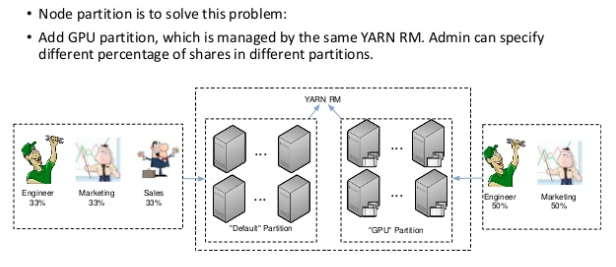
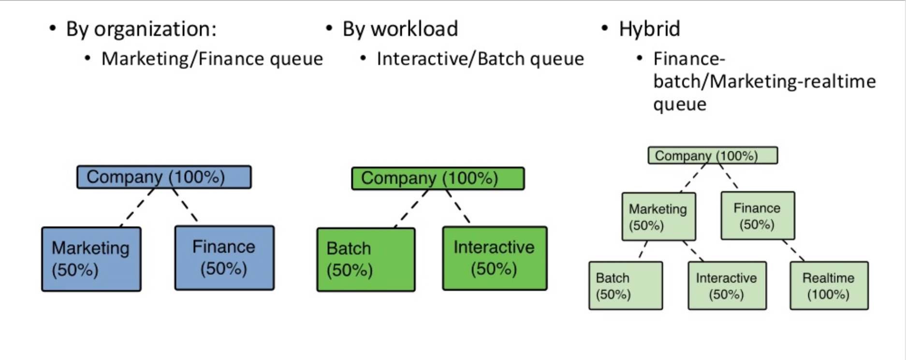
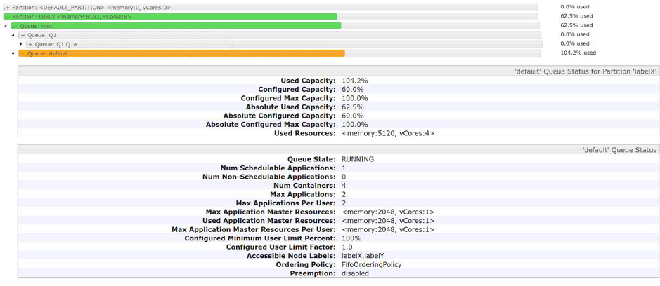

# EMR集群基于标签的资源分配

1. 背景与需求

当EMR集群规模较大，服务较多，如：安装了Hive, Spark, Presto, Hbase, Flink等组件，同时集群内也可能配置了不同的机型，如：C5, R5, P3等。对此，需要为不同的任务或服务分配不同的资源来运行，特别是对内存、计算，甚至GPU资源敏感的任务。因此，默认的资源调度可能无法满足需求。

此时，我们希望YARN集群在调度任务时能够按照我们希望的方式进行调度，而非采用默认的调试策略。如：对内存要求比较的任务不要跑在Presto节点上，需要使用GPU的任务运行在带GPU的节点上。

典型场景：



也可用于当集群服务于不同团队、部门或多租户时同样面临资源分配的需求，如何只使用已分配的额度，而不是将整个集群资源消耗完。

典型场景：



实现方式是通过为EMR节点设定标签，并为YARN Resource Manager设定不同的队列，再将节点与队列进行绑定，提交任务时可对标签进行指定。

 

2. 为EMR节点启用标签

在为EMR集群启用标签时，遇到了挑战，无法采用常规Hadoop集群设置标签的方法，体现在EMR集群的参数设置为：yarn.node-labels.configuration-type: distributed，并在节点的yarn-site.xml文件中指定了标签，例如：所有CORE节点都具备CORE标签。因此，无法使用以下命令来为EMR集群节点创建标签：

```
 yarn rmadmin -replaceLablesOnNode "Node=Label”
```

经过研究，不建议将Master节点的configuration-type改为centralized，已知会影响CORE node以及AM的分配，很可能还有其他未知风险。

添加标签的方法：

1). 为集群添加标签

```
yarn rmadmin -addToClusterNodeLabels "<label1>(exclusive=true|false)”
```

2). 查看已添加的标签

```
yarn cluster --list-node-labels
```

3). 修改节点上的yarn-site.xml

```
<property>
	<name>yarn.nodemanager.node-labels.provider</name>
  <value>config</value>
</property>
<property>
	<name>yarn.nodemanager.node-labels.provider.configured-node-partition</name>
  <value>***LabelName\***</value>
</property>
```

但这样的做法产生了一个问题：在启用了EMR AutoScaling并且有100个节点时，如何处理？因为无法手工对每个节点上的yarn-site.xml进行维护。所以，需要一种简化并能够自动的方式来创建和分配标签。

将yarn-site.xml中的参数修改为以下值：

```
<property>
	<name>yarn.nodemanager.node-labels.provider</name>
	<value>***script\***</value>
</property>
<property>
	<name>yarn.nodemanager.node-labels.provider.script.path</name>
	<value>***path\*** ***of\*** ***shell\*** ***script\***</value>
</property>
```

或采用命令行对集群配置进行修改：

```
aws emr modify-instance-groups --cli-input-json file://reconfiguration.json
```

示例：reconfiguration.json内容：

```
[ { 
    "Classification": "yarn-site", 
    "Properties": 
    { 
      “yarn.nodemanager.node-labels.provider” : "script", 
      “yarn.nodemanager.node-labels.provider.script.path” : ”path of shell script" 
    } 
} ] 
```

编写Shell脚本，来设定标签值，示例：

```
#!/bin/bash

instancetype=$(curl -s http://169.254.169.254/latest/meta-data/instance-type)

if [[ $instancetype == r* ]]; then
    echo "NODE_PARTITION:memorynode"
elif [[ $instancetype == c* ]]; then
    echo "NODE_PARTITION:cpunode"
elif [[ $instancetype == p* ]] || [[ $instancetype == g* ]]; then
    echo "NODE_PARTITION:gpunode"
else
    echo "NODE_PARTITION:standardnode"
fi
```


此示例实现的逻辑是根据机型来分配标签。

3. 配置YARN资源调度器

将YARN Resource Manager Scheduler配置为Capacity Scheduler（如当前已使用其他Scheduler，需要谨慎评估此更改）。

修改capacity-scheduler.xml文件，为标签配置队列，以限定每个队列可使用的资源，示例：

```
	<name>yarn.scheduler.capacity.root.queues</name>
	<value>financepool, marketingpool</value> //Capacity total <= 100 
	<name>yarn.scheduler.capacity.root.marketingpool.capacity</name>
	<value>50</value> 
	<name>yarn.scheduler.capacity.root.financepool.capacity</name>
	<value>50</value> 
	<!-- begin --> 
	<property>
		<name>yarn.scheduler.capacity.root.financepool.maximum-capacity</name>
		<value>100</value>
		<description></description> 
	</property>
	<property>
		<name>yarn.scheduler.capacity.root.financepool.accessible-node-labels</name>
		<value>cpunode</value>
	</property>
	<property>
		<name>yarn.scheduler.capacity.root.financepool.default-node-label-expression</name>
		<value>cpunode</value> 
	</property> 
	<property>
		<name>yarn.scheduler.capacity.root.financepool.accessible-node-labels.cpunode.capacity</name>
		<value>100</value>
	</property>
	<property>
		<name>yarn.scheduler.capacity.root.financepool.accessible-node-labels.cpunode.maximum-capacity</name>
		<value>100</value>
	</property>
	<!--  end --> 


```

4. 提交任务示例

以Spark为例：

./bin/spark-submit --class org.apache.spark.examples.SparkPi

​          --master yarn --deploy-mode cluster --driver-memory 3g --executor-memory 2g

​          **--conf spark.yarn.am.nodeLabelExpression=standardnode**

​          **--conf spark.yarn.executor.nodeLabelExpression=cpunode** jars/spark-examples.jar 10

 

通过YARN Web UI查看标签和资源分配：



其他支持节点标签的应用程序：
·    Hadoop MapReduce
·    Tez
·    Hbase
·    Storm
·    Ambari
·    Slider
·    Accumulo
